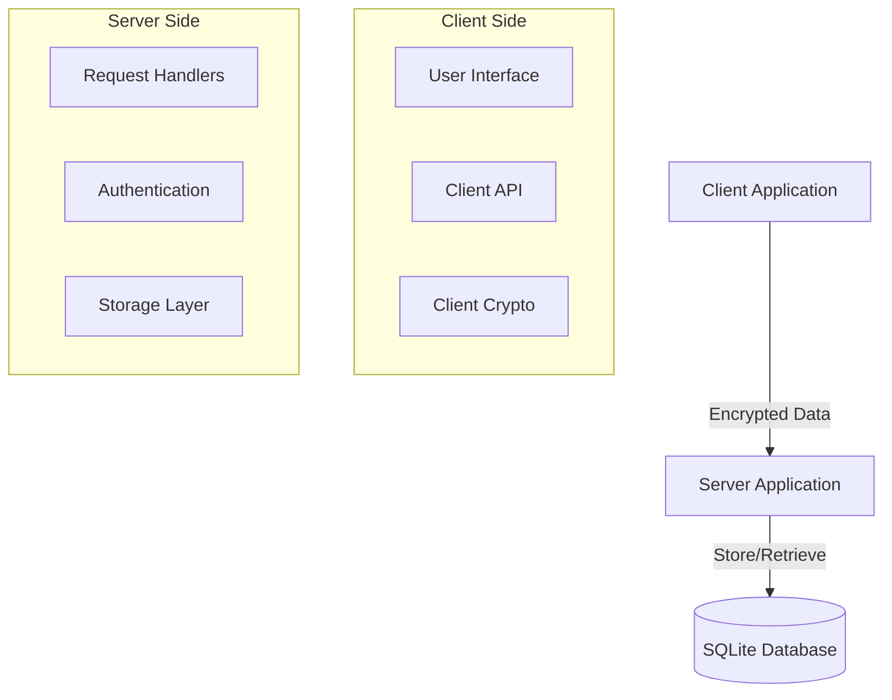
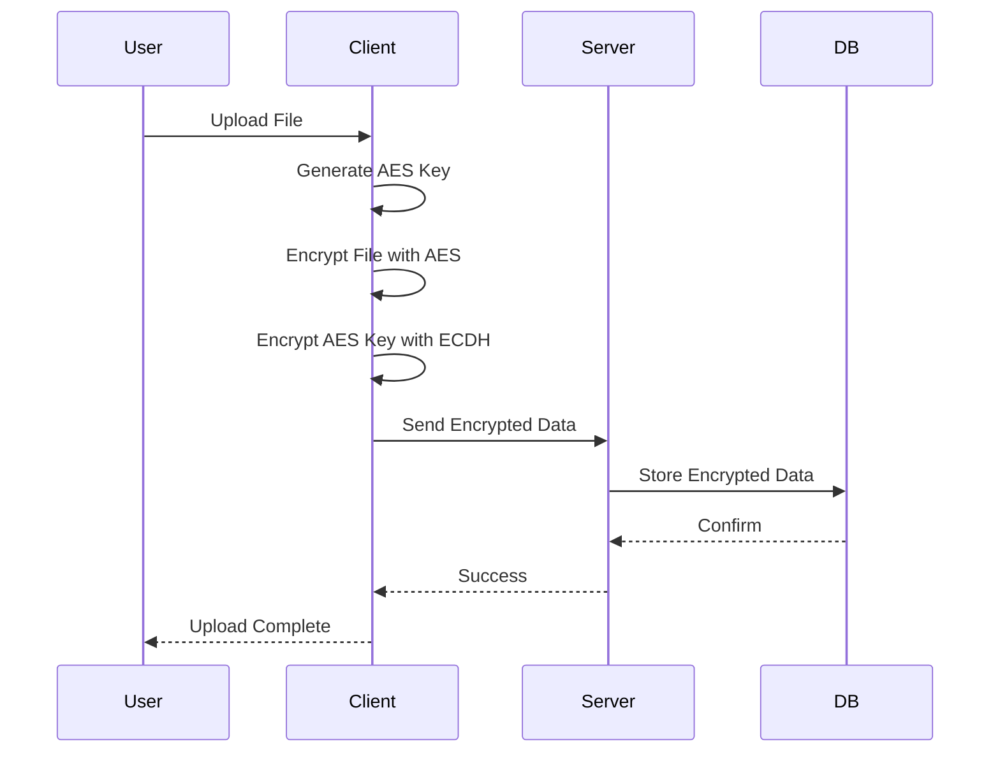

# BÁO CÁO ĐỒ ÁN LAB02 - HỆ THỐNG CHIA SẺ GHI CHÚ BẢO MẬT

## I. Giới thiệu đồ án

### 1. Mục tiêu ứng dụng

Xây dựng một nền tảng chia sẻ ghi chú an toàn, đảm bảo tính riêng tư của dữ liệu thông qua cơ chế mã hóa phía client. Máy chủ đóng vai trò lưu trữ "mù", không thể đọc được nội dung thực tế của ghi chú.

### 2. Cách chạy chương trình từ mã nguồn nộp kèm

#### 2.1 Cài đặt

**Yêu cầu:** Go 1.22+

**Các bước:**

1. Xóa `server.db` và các file `*.pem` cũ (nếu có)
2. Chạy Server:
   ```bash
   go run ./cmd/server/main.go
   ```
3. Chạy Client:
   ```bash
   go run ./cmd/client/main.go
   ```

#### 2.2 Hướng dẫn sử dụng (Client CLI)

Sau khi chạy Client (`go run ./cmd/client/main.go`), bạn sẽ thấy các menu sau tùy thuộc vào trạng thái đăng nhập.

##### Menu Chính (Chưa đăng nhập)

1. **Đăng nhập**: Dùng tài khoản đã có để vào hệ thống
2. **Đăng ký**: Tạo tài khoản mới. Hệ thống sẽ tự động sinh cặp khóa Public/Private (lưu tại file `username.pem`) phục vụ cho việc mã hóa/giải mã
3. **Tải từ Link**: Tải ghi chú từ đường dẫn chia sẻ công khai (không cần tài khoản)
4. **Thoát**: Đóng ứng dụng

##### Menu Người Dùng (Đã đăng nhập)

Sau khi đăng nhập thành công, bạn có thể thực hiện các chức năng:

1. **Liệt kê ghi chú**: Xem danh sách tất cả ghi chú bạn sở hữu hoặc được chia sẻ
2. **Xem nội dung ghi chú**: Giải mã và tải nội dung ghi chú về máy (cần nhập Note ID)
3. **Tạo ghi chú mới**: Upload và mã hóa file
   - Nhập tiêu đề ghi chú
   - Nhập đường dẫn file (VD: `C:\tailieu\secret.txt`)
4. **Xóa ghi chú**: Xóa ghi chú khỏi server (chỉ dành cho chủ sở hữu)
5. **Chia sẻ với người dùng**: Chia sẻ quyền truy cập cho người dùng khác trong hệ thống (cần Note ID và Tên người nhận)
6. **Danh sách đang chia sẻ**: Xem các ghi chú đã chia sẻ với người khác
7. **Thu hồi quyền chia sẻ**: Xóa quyền truy cập của người dùng đã được chia sẻ
8. **Tạo Link chia sẻ**: Tạo URL chia sẻ công khai (có chứa Token và Key giải mã)
9. **Tải từ Link chia sẻ**: Tải ghi chú từ Link chia sẻ
10. **Đăng xuất**
11. **Thoát**

### 3. Các chức năng đã triển khai và tính năng nâng cao

- **Xác thực an toàn**: Đăng ký/Đăng nhập với mật khẩu được bảo vệ bởi Salt và SHA-256. Quản lý phiên bằng JWT
- **Mã hóa đầu-cuối (E2EE)**:
  - Mỗi file được mã hóa bằng một khóa AES ngẫu nhiên riêng biệt
  - Khóa AES được bảo vệ bằng cơ chế trao đổi khóa Diffie-Hellman (ECDH X25519)
- **Chia sẻ linh hoạt**:
  - Chia sẻ cho người dùng cụ thể trong hệ thống
  - Chia sẻ công khai qua link (sử dụng Token và Fragment URL để bảo mật khóa)
  - Thu hồi quyền chia sẻ
- **Quản lý ghi chú**: 
  - Upload/Download file mã hóa
  - Xóa ghi chú
  - Tự động kiểm tra thời gian hết hạn

---

## II. Thiết kế và kiến trúc

### 1. Mô tả kiến trúc hệ thống và mục đích thiết kế

Hệ thống được xây dựng với mục tiêu tối thượng là **Bảo mật** và **Quyền riêng tư**.

- **Zero-Knowledge**: Server không bao giờ biết nội dung file gốc hay khóa mã hóa file
- **Client-Centric**: Mọi tác vụ mã hóa/giải mã đều diễn ra tại Client

#### Sơ đồ thiết kế



#### Sơ đồ luồng hoạt động



### 2. Các thành phần chính

#### 1. Client Application

- **Giao diện (UI)**: Cung cấp menu dòng lệnh (CLI) để người dùng tương tác (Đăng ký, Đăng nhập, Gửi/Nhận file)
- **Client API Layer**: Module chịu trách nhiệm đóng gói dữ liệu và gửi các HTTP Request tới Server
- **Client Crypto Module**: Thành phần quan trọng nhất, thực hiện mã hóa AES-256 nội dung file và trao đổi khóa ECDH. Đảm bảo dữ liệu rời khỏi máy người dùng luôn ở dạng mã hóa

#### 2. Server Application

- **Request Handlers**: Tiếp nhận các yêu cầu từ Client, kiểm tra tính hợp lệ của dữ liệu đầu vào
- **Authentication Middleware**: Xác thực người dùng thông qua JWT Token trước khi cho phép truy cập tài nguyên
- **Server Crypto Module**: Chỉ thực hiện các tác vụ của Server như băm mật khẩu (Hashing) và ký Token. Không dính dáng đến khóa giải mã file
- **Storage Layer**: Tương tác trực tiếp với cơ sở dữ liệu SQLite, thực hiện các truy vấn tối ưu hóa (WAL Mode)

#### 3. Database (Cơ sở dữ liệu)

- **SQLite**: Lưu trữ bền vững thông tin người dùng, metadata của ghi chú và các khối dữ liệu (BLOB) đã mã hóa

### 3. Công nghệ sử dụng

- **Ngôn ngữ**: Go (Golang) phiên bản 1.22+
- **Cơ sở dữ liệu**: SQLite (thư viện `modernc.org/sqlite v1.40.1` - Pure Go driver)
- **Xác thực**:
  - JWT: `github.com/golang-jwt/jwt/v5` để tạo và xác thực token Bearer
  - Password Hashing: SHA-256 kết hợp với Salt (16 bytes random hex) tự xây dựng
- **Mật mã học (Cryptography)**:
  - AES-GCM (256-bit): Dùng để mã hóa nội dung file (Thư viện chuẩn `crypto/aes`, `crypto/cipher`)
  - ECDH (Curve25519/X25519): Trao đổi khóa an toàn (Thư viện chuẩn `crypto/ecdh`)
  - KDF: SHA-256 để dẫn xuất khóa từ Shared Secret (Thư viện chuẩn `crypto/sha256`)
  - Random: `crypto/rand` (CSPRNG) để tạo Salt, IV, và Key

---

## III. Chi tiết cài đặt

### 1. Quy trình Mã hóa & Chia sẻ (ECDH + AES)

Đây là phần cốt lõi của ứng dụng.

#### Tạo khóa (Registration)

1. Client tạo cặp khóa ECDH X25519 (`PrivKey_A`, `PubKey_A`)
2. Gửi `PubKey_A` lên Server lưu trữ
3. `PrivKey_A` lưu bí mật tại file local (`username.pem`)

#### Upload & Mã hóa (Create Note)

1. Tạo khóa ngẫu nhiên `K_File` (32 bytes)
2. Mã hóa File: 
   ```
   EncryptedFile = AES-GCM(File, K_File)
   ```
3. Để chính mình đọc lại được, Client A lấy `PubKey_A` (của chính mình), kết hợp `PrivKey_A` → `SharedSecret`
4. Mã hóa khóa file:
   ```
   K_EncA = AES-GCM(K_File, SHA256(SharedSecret))
   ```
5. Gửi `(EncryptedFile, K_EncA)` lên Server

#### Chia sẻ cho B (Share Note)

1. Client A tải `PubKey_B` từ Server
2. Client A tính `SharedSecret_AB = ECDH(PrivKey_A, PubKey_B)`
3. Client A giải mã `K_File` (dùng khóa của mình)
4. Client A mã hóa `K_File` bằng `SharedSecret_AB`:
   ```
   K_EncB = AES-GCM(K_File, SHA256(SharedSecret_AB))
   ```
5. Gửi `K_EncB` lên Server cho B

### 2. Tối ưu hóa (Optimization)

- **SQLite (Pure Go)**: Sử dụng driver không cần CGO (`modernc.org/sqlite`) giúp việc biên dịch và chạy trên Windows dễ dàng hơn, không cần cài GCC
- **Write-Ahead Logging (WAL)**: Cấu hình `PRAGMA journal_mode=WAL;` giúp tăng hiệu năng xử lý đồng thời, cho phép đọc/ghi song song
- **Connection Pooling**: Sử dụng DSN parameters (`busy_timeout=5000`) để quản lý timeout kết nối hiệu quả, tránh lỗi "database locked" khi tải cao
- **Indexing**: Đánh chỉ mục cho các trường `owner_id` và `share_token` để tăng tốc độ truy vấn
- **JWT Caching**: Server xác thực Stateless, không cần query DB để check session ID mỗi lần request (tuy nhiên vẫn check user existence)

---

## IV. Thách thức và giải pháp

### 1. Chuyển đổi từ RSA sang ECDH

- **Vấn đề**: RSA mã hóa trực tiếp được khóa nhỏ, nhưng ECDH chỉ tạo ra Shared Secret chứ không mã hóa trực tiếp
- **Giải pháp**: Sử dụng cơ chế Key Wrapping. Dùng ECDH để tạo Shared Secret, sau đó `Hash(SharedSecret)` để làm khóa AES dùng để mã hóa cái "File Key". Đây là mô hình Hybrid Encryption chuẩn

### 2. Bảo mật Mật khẩu

- **Vấn đề**: SHA-256 thuần túy dễ bị tấn công bởi Rainbow Table
- **Giải pháp**: Triển khai Salt. Mỗi user có một chuỗi Salt ngẫu nhiên 16-byte lưu trong DB. Khi hash, chuỗi này được nối vào password

### 3. Đồng bộ hóa (Concurrency)

- **Vấn đề**: SQLite mặc định lock toàn bộ database khi ghi, gây lỗi khi stress test nhiều user
- **Giải pháp**:
  - Chuyển sang WAL Mode (Write-Ahead Logging)
  - Cấu hình Busy Timeout để driver tự động chờ (backoff) thay vì fail ngay

### 4. Cross-platform Input Handling

- **Vấn đề**: Thư viện `promptui` gây lỗi duplicate prompt trên Windows/Git Bash
- **Giải pháp**: 
  - Thay thế bằng `bufio.Scanner` cho input thông thường
  - Sử dụng `golang.org/x/term` cho password masking (cross-platform)

---

## V. Kết quả kiểm thử

### Test Suite Results

```
==================================
   Lab02 Test Suite Runner
==================================

🧪 Running Authentication Tests...
✅ Authentication Tests: PASSED

🔐 Running Encryption Tests...
✅ Encryption Tests: PASSED

🔒 Running Access Control Tests...
✅ Access Control Tests: PASSED

🔄 Running E2E Encryption Tests...
✅ E2E Encryption Tests: PASSED

🚀 Running Integration Tests...
✅ Integration Tests: PASSED

👥 Running Multi-User Share Tests...
✅ Multi-User Share Tests: PASSED

==================================
   Test Summary
==================================
Passed: 6 / 6 test suites
✨ All tests passing!
```

### Các test case chính

1. **Authentication Tests**: Đăng ký, đăng nhập, xác thực JWT
2. **Encryption Tests**: Mã hóa/giải mã AES, ECDH key exchange
3. **Access Control Tests**: Kiểm tra quyền truy cập ghi chú
4. **E2E Encryption Tests**: Luồng mã hóa đầu-cuối hoàn chỉnh
5. **Integration Tests**: Workflow đầy đủ từ đăng ký đến chia sẻ
6. **Multi-User Share Tests**: Chia sẻ giữa nhiều người dùng, thu hồi quyền

---

## VI. Kết luận

Đồ án đã triển khai thành công một hệ thống chia sẻ ghi chú bảo mật với các đặc điểm nổi bật:

- ✅ **Bảo mật cao**: Mã hóa đầu-cuối (E2EE) với AES-256 và ECDH X25519
- ✅ **Zero-Knowledge**: Server không thể đọc nội dung ghi chú
- ✅ **Hiệu năng tốt**: Tối ưu hóa với WAL mode, connection pooling
- ✅ **Cross-platform**: Chạy tốt trên Windows và Linux
- ✅ **Đầy đủ tính năng**: Chia sẻ, thu hồi quyền, link công khai
- ✅ **Kiểm thử kỹ lưỡng**: 6/6 test suites passed

Hệ thống đã sẵn sàng cho việc triển khai và sử dụng thực tế.
