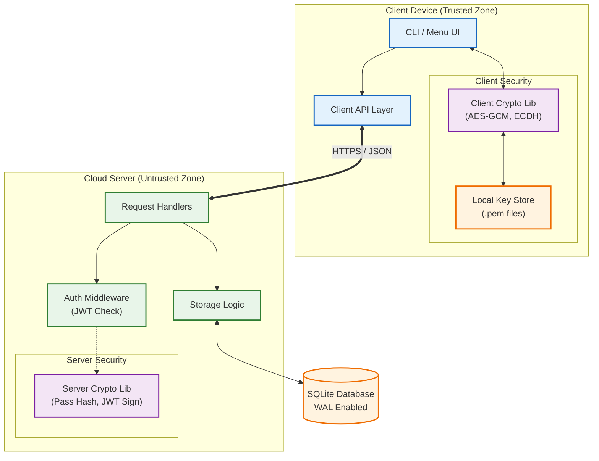
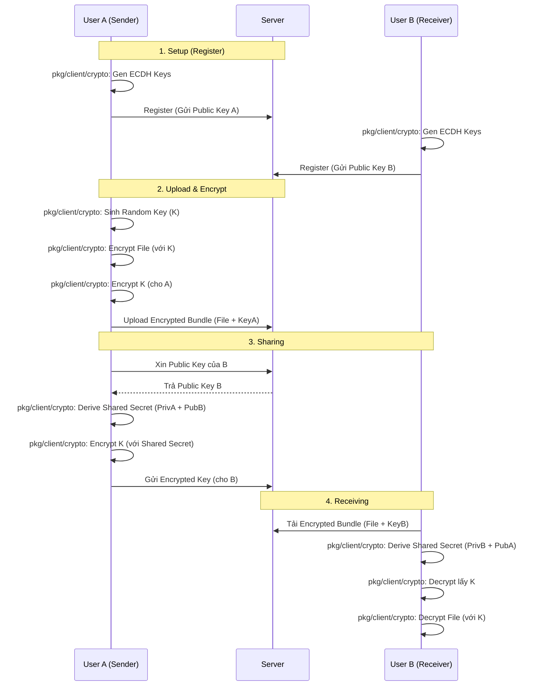

# Ứng Dụng Chia Sẻ Ghi Chú Bảo Mật (Secure Note Sharing App)

Một nền tảng chia sẻ ghi chú an toàn, đảm bảo tính riêng tư và toàn vẹn dữ liệu thông qua cơ chế **Mã hóa phía Client (Client-side Encryption)**.

Hệ thống được thiết kế theo mô hình **Zero-Knowledge**, nghĩa là Server chỉ đóng vai trò lưu trữ và trung chuyển dữ liệu đã được mã hóa, hoàn toàn không có khả năng đọc được nội dung thực tế của ghi chú.

## 🚀 Tính Năng Nổi Bật

*   **Mã Hóa Đầu-Cuối (End-to-End Encryption)**: Dữ liệu được mã hóa AES-256 GCM ngay tại máy người dùng trước khi gửi đi.
*   **Chia Sẻ An Toàn (Secure Sharing)**: Sử dụng giao thức trao đổi khóa **ECDH (X25519)** để chia sẻ ghi chú giữa các người dùng mà không lộ khóa.
*   **Truy Cập Có Giới Hạn (Time-Sensitive Access)**: Hỗ trợ tạo liên kết chia sẻ (Sharable Links) có thời hạn và tự động vô hiệu hóa.
*   **Xác Thực Mạnh Mẽ**:
    *   Mật khẩu được bảo vệ bằng **Salt + PBKDF2/SHA-256**.
    *   Quản lý phiên làm việc bằng **JWT (JSON Web Token)**.
*   **Đơn Giản & Hiệu Quả**: Viết bằng **Go**, sử dụng **SQLite** (Pure Go), dễ dàng triển khai trên mọi nền tảng (Windows, Linux, macOS).

## 🏗️ Kiến Trúc & Thiết Kế

### Phân tách Logic (Logic Separation)

Hệ thống được thiết kế với sự phân chia trách nhiệm rõ ràng nhằm đảm bảo **Zero-Knowledge** từ phía Server.

#### 🖥️ Logic Client (`cmd/client`)
Client là nơi duy nhất xử lý dữ liệu nhạy cảm.
*   **Quản lý Khóa (Key Management)**:
    *   Sinh cặp khóa ECDH (Curve25519) khi đăng ký.
    *   Lưu Private Key bảo mật tại local (`.pem`).
    *   Sinh khóa AES ngẫu nhiên cho mỗi file.
*   **Mã hóa/Giải mã (Cryptography)**:
    *   Mã hóa nội dung file bằng AES-256 GCM trước khi upload.
    *   Mã hóa khóa AES bằng Shared Secret (ECDH) khi chia sẻ.
    *   Giải mã dữ liệu sau khi tải về từ Server.
*   **Giao diện (UI/CLI)**:
    *   Menu tương tác người dùng (PromptUI).
    *   Gửi request REST API tới Server.

#### ☁️ Logic Server (`cmd/server`)
Server đóng vai trò là "Kho chứa mù" (Blind Storage) và quản lý định danh.
*   **API & Routing**: Cung cấp các RESTful endpoint (`/register`, `/login`, `/notes`, ...).
*   **Lưu trữ & CSDL (Storage)**:
    *   Lưu trữ Metadata (Tiêu đề, Owner ID, Shared Users) và Blob dữ liệu đã mã hóa vào SQLite.
    *   Quản lý bảng `users`, `notes`, `shared_keys`.
*   **Xác thực (Authentication)**:
    *   Xác minh mật khẩu (Salt + Hash).
    *   Cấp và kiểm tra JWT Token cho các request.
    *   Kiểm tra quyền truy cập (Access Control) dựa trên ID người dùng.

### Sơ đồ kiến trúc (System Architecture)



### Sơ đồ luồng hoạt động (Activity Flow)

Dưới đây là luồng quy trình chia sẻ ghi chú an toàn giữa User A và User B:


## 🛠️ Công Nghệ Sử Dụng

*   **Ngôn ngữ**: Go (Golang) 1.22+
*   **Cơ sở dữ liệu**: SQLite (`modernc.org/sqlite`)
*   **Thư viện Mật mã**:
    *   `crypto/aes`, `crypto/cipher`: Mã hóa dữ liệu.
    *   `crypto/ecdh`: Trao đổi khóa.
    *   `crypto/sha256`: Hashing & KDF.
    *   `crypto/rand`: CSPRNG.
    
### ⚡ Hiệu Năng & Tối Ưu (Performance)
*   **Hibernate WAL Mode**: Sử dụng chế độ **Write-Ahead Logging** cho SQLite để tăng tốc độ ghi và hỗ trợ concurrency tốt hơn.
*   **Connection Pooling**: Cấu hình `busy_timeout` và `synchronous=NORMAL` để tối ưu hóa pool kết nối.
*   **Indexing**: Đánh chỉ mục (Indexing) cho các trường truy vấn thường xuyên như `owner_id` và `share_token` để giảm thời gian tìm kiếm.

## 📦 Cài Đặt & Chạy Ứng Dụng

### Yêu cầu tiên quyết
*   [Go](https://go.dev/dl/) phiên bản 1.22 trở lên.

### 1. Khởi chạy Server
Mở terminal tại thư mục gốc của dự án:

```bash
go run ./cmd/server/main.go
```
Server sẽ lắng nghe tại cổng mặc định (ví dụ: `8080`).

### 2. Khởi chạy Client
Mở một terminal khác:

```bash
go run ./cmd/client/main.go
```

## 📖 Hướng Dẫn Sử Dụng (Client CLI)

Sau khi chạy Client (`go run ./cmd/client/main.go`), bạn sẽ thấy các menu sau tùy thuộc vào trạng thái đăng nhập.

### Menu Chính (Chưa đăng nhập)
1.  **Đăng nhập**: Dùng tài khoản đã có để vào hệ thống.
2.  **Đăng ký**: Tạo tài khoản mới. Hệ thống sẽ tự động sinh cặp khóa Public/Private (lưu tại file `username.pem`) phục vụ cho việc mã hóa/giải mã.
3.  **Tải từ Link**: Tải ghi chú từ đường dẫn chia sẻ công khai (không cần tài khoản).
4.  **Thoát**: Đóng ứng dụng.

### Menu Người Dùng (Đã đăng nhập)
Sau khi đăng nhập thành công, bạn có thể thực hiện các chức năng:

1.  **Tạo ghi chú**: Upload và mã hóa file.
    *   Nhập tiêu đề ghi chú.
    *   Nhập đường dẫn file (VD: `C:\tailieu\secret.txt`).
2.  **Liệt kê ghi chú**: Xem danh sách tất cả ghi chú bạn sở hữu hoặc được chia sẻ.
3.  **Xem ghi chú**: Giải mã và tải nội dung ghi chú về máy.
    *   Cần nhập `Note ID` (lấy từ chức năng liệt kê).
4.  **Chia sẻ ghi chú**: Chia sẻ quyền truy cập cho người dùng khác trong hệ thống.
    *   Cần `Note ID` và `Tên người nhận`.
5.  **Chia sẻ qua Link**: Tạo URL chia sẻ công khai (có chứa Token và Key giải mã).
6.  **Tải từ Link**: Tải ghi chú từ Link chia sẻ (tương tự chức năng ở menu chính).
7.  **Xóa ghi chú**: Xóa ghi chú khỏi server (chỉ dành cho chủ sở hữu).
8.  **Đăng xuất**.
9.  **Thoát**.

## 📂 Cấu Trúc Dự Án (Project Structure)

Dự án được tổ chức theo chuẩn Go Project Layout:

```
lab02/
├── cmd/                # Entry points của ứng dụng
│   ├── client/
│   │   └── main.go     # Mã nguồn chính của Client (CLI)
│   └── server/
│       └── main.go     # Mã nguồn chính của Server (API)
├── pkg/                # Các thư viện dùng chung (Library Code)
│   ├── client/
│   │   ├── api/        # Client API Implementation
│   │   ├── crypto/     # Client-side Crypto (AES, ECDH)
│   │   └── ui/         # User Interface (CLI)
│   ├── server/
│   │   ├── crypto/     # Server-side Crypto (JWT, Hash)
│   │   ├── handlers/   # API Handlers
│   │   └── storage/    # Database Logic
│   └── models/
│       └── models.go   # Data Structures (User, Note)
├── database/           # Chứa file SQLite (được tạo khi chạy)
├── go.mod              # Go module definition
├── requirements.md     # Yêu cầu bài tập
└── report.md           # Báo cáo chi tiết
```

## 🛡️ Bảo Mật & Lưu Ý

*   **Private Key (`.pem`)**: File này chứa khóa bí mật của bạn. **TUYỆT ĐỐI KHÔNG** xóa hoặc chia sẻ file này. Nếu mất file này, bạn sẽ không thể giải mã các ghi chú được chia sẻ.
*   **Cơ chế Hash**: Server sử dụng Salt ngẫu nhiên cho mỗi user để chống lại Rainbow Table attacks.

---
*Dự án môn học Nhập môn Mã hóa Mật mã - HCMUS*
